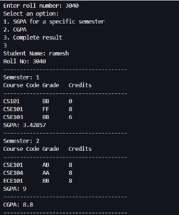
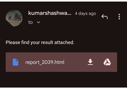
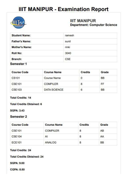

# RESULTO: Advancing the Result System 📊

> A C++ based student result management system with automated grade calculations, HTML report generation, secure teacher login, result queries, and email notifications using `libcurl`.

---

## 📚 Overview

RESULTO is a command-line application developed in C++ to automate student academic result processing. It provides:
- Grade entry & SGPA/CGPA calculations
- Teacher authentication
- HTML report generation
- Performance query tools
- Email notification for declared results

---

## 🎯 Project Objectives

- Implement a C++ system using OOP (Student, Course, Teacher classes)
- Use vectors & maps for efficient data storage
- Handle CSV I/O for persistence
- Generate CLI and HTML reports
- Support email notification using libcurl
- Enable advanced result queries

---

## ⚙️ Tech Stack

| Layer         | Technology        |
|--------------|-------------------|
| Language      | C++               |
| Data Storage  | CSV               |
| Libraries     | STL, fstream, libcurl (optional) |
| Interface     | CLI + HTML output |

---

## 🧾 Project Structure

```
resulto/
├── src/
│   ├── main.cpp
│   ├── student.h / student.cpp
│   ├── course.h / course.cpp
│   ├── teacher.h / teacher.cpp
│   └── utilities.cpp
│
├── data/
│   ├── students.csv
│   ├── grades.csv
│   ├── courses.csv
│   └── teacher_credentials.csv
│
├── reports/         # HTML report output
├── screenshots/
└── README.md
```

### 🖥️ CLI Interface Output


---

### 🧾 Result Declaration via Email


---

### 🧾 HTML Result Report


---
---

## 🚀 How to Run

### ✅ Pre-requisites

- C++ Compiler (g++, clang)
- libcurl (optional for email)
- IDE like Code::Blocks / VS Code

### 🛠 Compile & Execute

```bash
g++ -o resulto src/main.cpp
./resulto
```

---

## 👨‍🏫 Teacher Login

Credential file: `teacher_credentials.csv`

```csv
username,password
john_doe,securepass
```

---

## 📑 Features Summary

- ✔️ Add/Edit Student/Course/Grades
- ✔️ Teacher/Admin Login
- ✔️ SGPA/CGPA auto calculation
- ✔️ HTML Report export
- ✔️ Email notifications (via curl)
- ✔️ Query Helper (toppers, failed, CGPA > X)

---

## 📄 HTML Report

Output: `report_<roll>.html`

Includes:
- Student info
- Semester-wise grades
- SGPA per semester
- Final CGPA

Open with browser:
```
reports/report_220103040.html
```

---

## 📬 Email Sending with libcurl

Automates report distribution via email using `libcurl`.

### Example:
```bash
curl --url 'smtps://smtp.gmail.com:465' --ssl-reqd \
  --mail-from 'admin@example.com' \
  --mail-rcpt 'student@example.com' \
  --upload-file report_220103040.html \
  --user 'admin@example.com:yourpassword'
```

### Setup:
- Enable SMTP for your Gmail account
- Turn on "less secure app access" or use App Passwords

---

## 🔍 Query Helper

Use `QueryHelper()` to get:

- Students with CGPA > X
- Branch toppers
- Failed students
- Students with A grade in any course
- Students with SPI > Y for semester Z

Example:
```
> Query: Students with CGPA > 8.5
> Output: [220103040, 220103016]
```

---

## 📥 Sample CSV Format

`students.csv`
```csv
rollNo,name,branch,fatherName,motherName
220103040,Shashwat Kumar,CSE,Ram Kumar,Sita Devi
```

`grades.csv`
```csv
rollNo,semester,courseCode,grade
220103040,3,CS101,A
```

`courses.csv`
```csv
courseCode,courseName,credits
CS101,Data Structures,4
```

---

## 🧪 Implementation Summary

- **SGPA Calculation:** Weighted average using course credits
- **CGPA Calculation:** Mean of SGPA across semesters
- **File Handling:** Read/write grades/students/courses from CSVs
- **Data Structures:** `std::vector`, `std::map`
- **Report Generation:** HTML output using `<style>` + file streams

---

## 👨‍💻 Author

**Shashwat Kumar**  
Guided by: Dr. Moirangthem Dennis Singh

---


